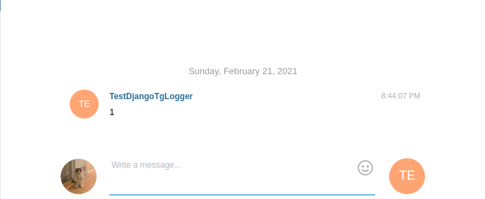

Django Telegram Logger
=======================================
Sometimes in production I want to see some errors faster than I can see them just in the console on the server

Quick Start
-----------

**1. Install using pip:**

.. code-block:: console

    pip install django-telegram-logger

**2. Include "soet" to your INSTALLED_APPS:**

.. code-block:: python

    INSTALLED_APPS = [
        ...
        'telegram_logger',
    ]

**3. Include "StackOverflowMiddleware" to your MIDDLEWARE_CLASSES:**

.. code-block:: python

    MIDDLEWARE_CLASSES = (
        ...
        'telegram_logger.middleware.TelegramLoggerMiddleware',
    )

.. code-block:: python

    MIDDLEWARE_CLASSES = (
        ...
        'telegram_logger.middleware.TelegramLoggerMiddleware',
    )

**4. Configuration in your Django settings**
    
.. code-block:: python
    
    TELEGRAM_LOGGER_CONF = {
        'TOKEN_BOT': <your token here> (REQUIRED) 
        'USER_ID': <your telegram id (REQUIDER) you can find it at the bot @ShowJsonBot
        'SEND_EXCEPTION' True/False (OPTIONAL) - need when do you want send any exception in your view 
    }

Example
-----------
view.py

.. code-block:: python
    
    def test_view(request):
        request.tg_logger.message('1')
        return HttpResponse(200)
    
**Result**

